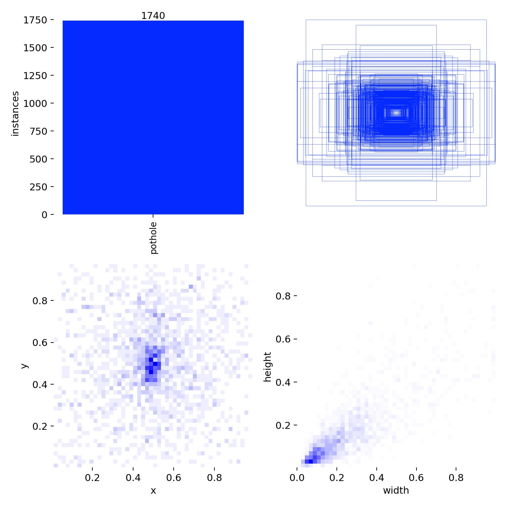
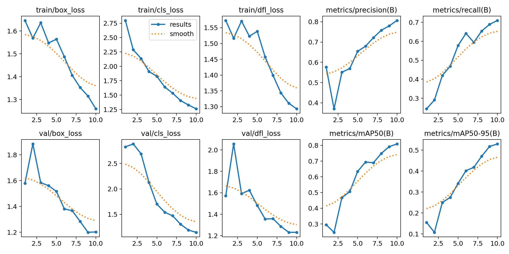
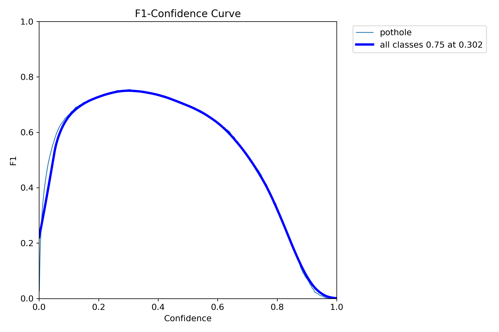
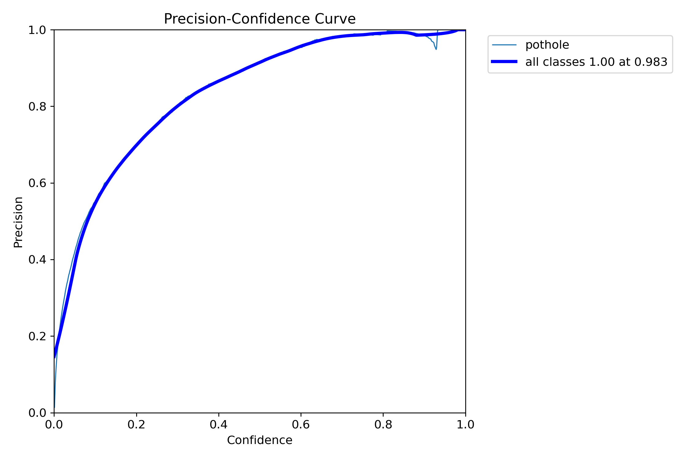
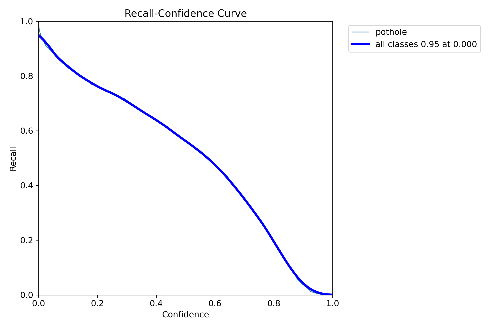
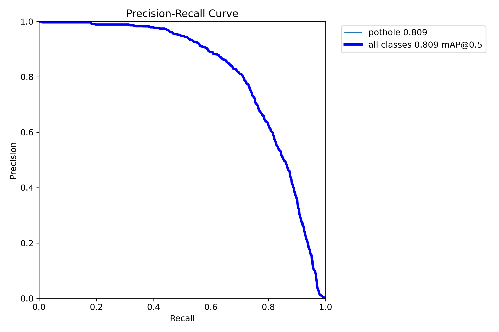
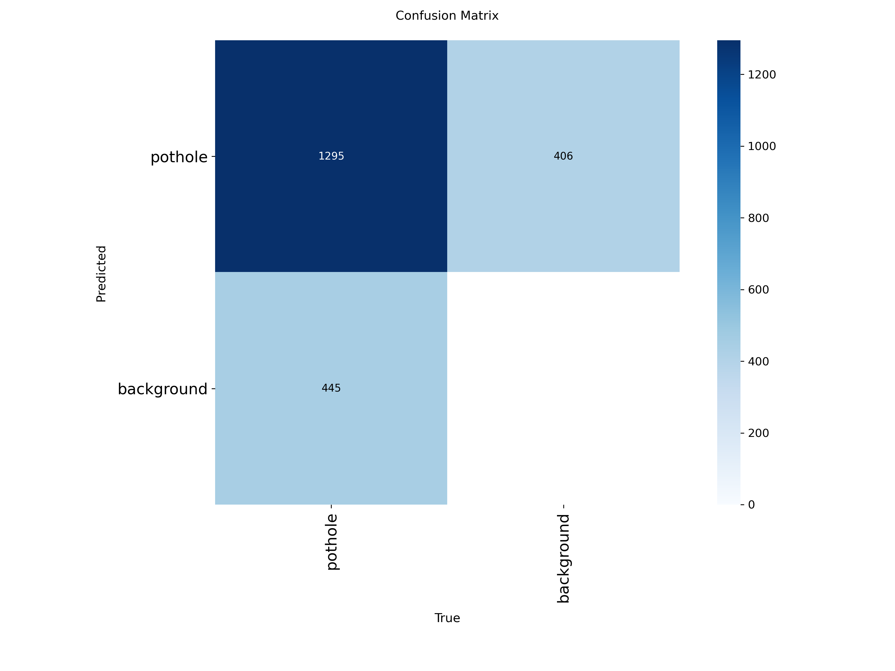
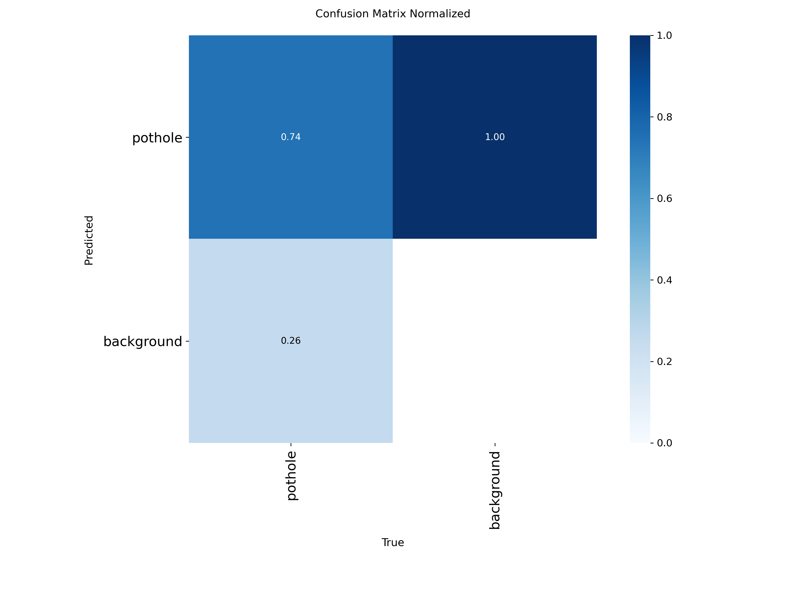

# 🛣️ YOLOv8-Based Pothole Detection

An AI-powered pothole detection system built using **YOLOv8 Nano (YOLOv8n)** and **OpenCV** to automatically detect potholes in road images and videos. The project was developed as part of the **Machine Learning (UML501)** course at **Thapar Institute of Engineering and Technology**.

---

## 📌 Project Overview

Road potholes are a major cause of vehicle damage and road accidents. Manual road inspection is slow, expensive, and inefficient. This project automates pothole detection using a deep learning-based object detection model capable of identifying potholes from images and videos.

The model was trained on a labeled pothole dataset and generates bounding boxes around detected potholes with confidence scores.

---

## ✨ Features

- Detects potholes in both **images** and **videos**
- Built using **YOLOv8 Nano (YOLOv8n)**
- Custom OpenCV visualization with bounding boxes
- Automatic image prediction and video processing
- Lightweight model suitable for CPU execution
- Performance evaluation using Precision, Recall and mAP

---

## 🛠️ Technologies Used

- Python
- YOLOv8 (Ultralytics)
- OpenCV
- NumPy
- Roboflow Dataset

---

## 📂 Dataset

The model was trained using a pothole dataset obtained from **Roboflow**.

| Dataset Information | Value |
|---------------------|------:|
| Total Images | 598 |
| Training Images | 465 |
| Validation Images | 133 |
| Classes | 1 (Pothole) |

Images were automatically preprocessed by YOLOv8 using resizing, normalization and augmentation techniques.

---

# 📸 Dataset Distribution



---

## 🧠 Model Configuration

| Parameter | Value |
|-----------|------:|
| Model | YOLOv8n |
| Epochs | 10 |
| Image Size | 640 × 640 |
| Batch Size | 8 |
| Optimizer | AdamW |
| Device | CPU |

---

# 📈 Training Results

The model showed continuous improvement during training with decreasing loss values and increasing detection performance.



---

## 📸 Training Samples

| Augmented Batch 1 | Augmented Batch 2 |
|-------------------|-------------------|
|  |  |

| Augmented Batch 3 |
|-------------------|
|  |

---

## 📊 Performance Metrics

| Metric | Score |
|----------|-------:|
| Precision | **0.78** |
| Recall | **0.63** |
| mAP@0.5 | **0.72** |
| mAP@0.5:0.95 | **0.39** |

---

# 📈 Evaluation Curves

### F1 Score Curve



### Precision Curve



### Recall Curve



### Precision-Recall Curve



---

# 📉 Confusion Matrix

### Confusion Matrix



### Normalized Confusion Matrix



---

# 🎥 Video Detection

The trained model processes road videos frame-by-frame and draws bounding boxes around detected potholes with confidence scores.

Example output video:

```
runs/opencv_video_output/pothole_detected.mp4

```

## 📁 Project Structure

```
YOLOv8-Pothole-Detection/
│
├── images/
│   ├── labels.jpg
│   ├── results.png
│   ├── train_batch0.jpg
│   ├── train_batch1.jpg
│   ├── train_batch2.jpg
│   ├── BoxF1_curve.png
│   ├── BoxP_curve.png
│   ├── BoxPR_curve.png
│   ├── BoxR_curve.png
│   ├── confusion_matrix.png
│   └── confusion_matrix_normalized.png
│
├── runs/
├── train/
├── data.yaml
├── project.py
├── requirements.txt
├── README.md
└── yolov8n.pt
```

---

## ⚙️ Installation

Clone the repository

```bash
git clone https://github.com/yourusername/YOLOv8-Pothole-Detection.git
```

Move into the project directory

```bash
cd YOLOv8-Pothole-Detection
```

Install dependencies

```bash
pip install -r requirements.txt
```

---

## ▶️ Running the Project

Run the Python script

```bash
python project.py
```

The script will:

- Train the YOLOv8 model
- Generate prediction results on validation images
- Detect potholes in the provided video
- Save the annotated output video

---

## 🚀 Future Improvements

- Multi-class road damage detection
- GPU-based training
- Larger and more diverse datasets
- Integration with drones and smart city surveillance
- GPS/GIS-based pothole mapping
- Mobile application for road monitoring

---

## 👩‍💻 Contributors

**Shreya**  
B.E Robotics & Artificial Intelligence  
Thapar Institute of Engineering and Technology

---

